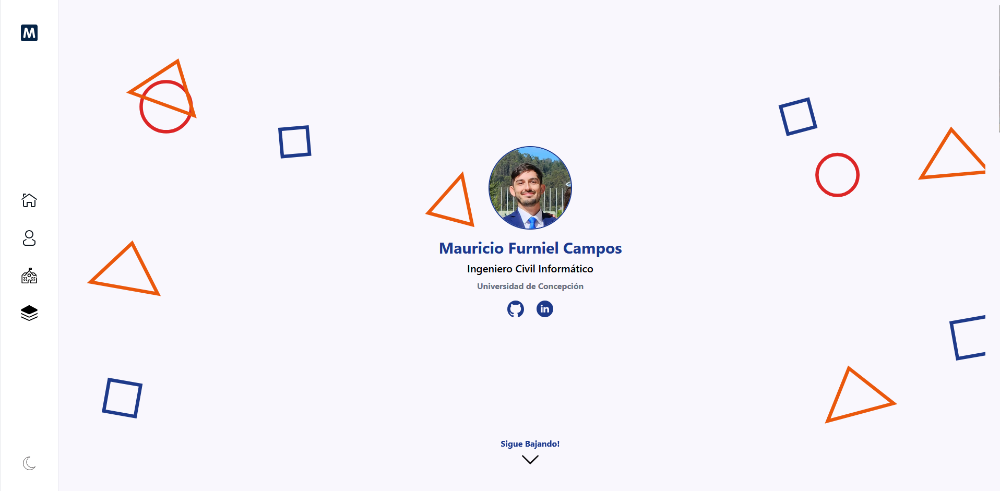

# Tech Test Portfolio



Welcome to **Tech Test Portfolio**, a technical challenge focused on building a landing page using modern technologies. This repository contains the setup and guides necessary for development.

[Click here to visit the Porject](https://tech-test-portafolio.vercel.app/)


## 📌 Table of Contents

1. [About the Project](#about-the-project)
2. [Requirements](#requirements)
3. [Installation and Setup](#installation-and-setup)
4. [Project Structure](#project-structure)
5. [Development and Commands](#development-and-commands)
6. [Code Quality](#code-quality)
7. [Version Control](#version-control)
8. [Testing with Playwright](#testing-with-playwright)
9. [Submission and Evaluation](#submission-and-evaluation)

---

## 📖 About the Project

This project involves creating a **landing page** using:

- **Astro.js v5** 🚀
- **Tailwind CSS v4** 🎨
- **Vue.js v3.5** ⚡
- **TypeScript** 🛠️

### ✨ Landing Page Sections

The landing page must include:

- **About Me** – A brief personal introduction.
- **Projects** – Showcasing completed projects.
- **Technologies** – Technologies used in development.
- **Education** – Academic background.

### 🎯 Technical Objectives

- **Deployment on Vercel** (using the free tier).
- **Performance and SEO optimization**.
- **Implementation of SSR** with Astro.js.
- **At least one interactive component with Vue.js**.

---

## ⚙️ Requirements

To run this project, ensure you have the following installed:

- **Node.js** (Latest LTS recommended)
- **npm** (Latest version recommended)

---

## 🚀 Installation and Setup

To set up the project locally:

```bash
git clone github.com/mfurniel/tech-test-portfolio.git
cd tech-test-portfolio
npm install
npm run dev
```

The development server will run at `http://localhost:4321`.

---

## 📂 Project Structure

```md
.
│
public/
│
src/
├── components/
│   ├── sections/
│   │   ├── about/
│   │   │   └── ui/
│   │   │   └── About.astro
│   │   │   └── About.spec.ts
│   │   ├── education/
│   │   │   └── ui/
│   │   ├── experience/
│   │   ├── home/
│   │   └── projects/
│   │       └── ui/
│   ├── tests/
│   │       ├── layout/  
│   │       └── pages/  
│   └── shared/
├── layouts/
├── pages/
└── styles/

```

---

## 💻 Development and Commands

| Command                   | Action                                           |
| :------------------------ | :----------------------------------------------- |
| `npm install`             | Installs dependencies                            |
| `npm run dev`             | Starts the development server                    |
| `npm run build`           | Builds the project for production (`./dist/`)   |
| `npm run preview`         | Previews the production build locally           |
| `npm run astro ...`       | Run Astro CLI commands                          |
| `npm run astro -- --help` | Shows help for Astro CLI                        |

---

## 🎨 Code Quality

This project uses tools to maintain clean and consistent code:

- **ESLint** → Linting for JavaScript, TypeScript, and Astro.
- **Stylelint** → Linting for CSS, SCSS, Vue, and Astro.
- **Prettier** → Code formatting.
- **Husky** → Pre-commit hooks to enforce code quality.
- **Commitlint** → Enforces structured commit messages.

### 🛠️ Formatting and Linting Commands

| Command                 | Action                                          |
| :---------------------- | :---------------------------------------------- |
| `npm run format`        | Formats the code using Prettier                |
| `npm run lint`          | Checks for linting issues                      |
| `npm run lint:fix`      | Fixes linting issues automatically              |
| `npm run lint:css`      | Checks for style linting issues                 |
| `npm run lint:css:fix`  | Fixes style linting issues automatically        |

---

## 🔗 Version Control

This project follows commit conventions enforced by **Commitlint**.

Commit structure example:

```
<type>(optional scope): description

[optional body]

[optional footer]
```

| Type      | Description                                                  |
| :-------- | :----------------------------------------------------------- |
| **feat**  | A new feature                                                |
| **fix**   | A bug fix                                                    |
| **docs**  | Documentation changes                                        |
| **style** | Code formatting changes                                      |
| **refactor** | Code changes without adding features or fixing bugs      |
| **perf**  | Performance improvements                                     |
| **test**  | Adding or updating tests                                     |
| **build** | Changes to build system or dependencies                      |
| **ci**    | Continuous integration configuration changes                 |
| **chore** | Maintenance tasks                                            |

Example:

```bash
git commit -m "feat(auth): add login with JWT"
```

Additionally, **Husky** runs validations before each commit and push:

| Hook       | Action                                         |
| ---------- | ----------------------------------------       |
| `pre-commit` | Runs linting before committing               |
| `pre-push`  | Runs build and functional tests before pushing|

---

## 🧪 Testing with Playwright

End-to-end tests are conducted using **Playwright** to ensure functionality.

| Command | Description |
| ------- | ----------- |
| `npx playwright test` | Runs all end-to-end tests. |
| `npx playwright test --ui` | Starts UI mode for visual testing. |
| `npx playwright test --project=chromium` | Runs tests only on Chrome. |
| `npx playwright test example` | Runs tests for a specific file. |
| `npx playwright test --debug` | Runs tests in debug mode. |
| `npx playwright codegen` | Generates test cases automatically. |

Example execution:

```bash
npm run test:functional
```
---

## 📌 Submission and Evaluation

### 📤 Submission Requirements

- **Source Code** → Upload the project to a public GitHub repository.
- **Hosting** → Deploy the landing page on **Vercel**.

### 📊 Evaluation Criteria

- **Responsiveness** – Proper adaptation to different screen sizes.
- **Google Lighthouse Score** – Performance, accessibility, best practices, and SEO.
- **Code Quality** – Clear structure, modularity, and best practices.

### 📅 Deadline

🕒 **Final submission deadline is March 9, 2025, at 23:59 hrs**.

---

